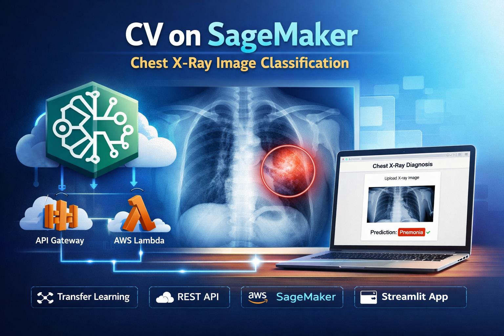

# CV on SageMaker — Chest X-Ray Image Classification

End-to-end computer vision project demonstrating training and deployment of a **binary Chest X-Ray image classifier** using **transfer learning** with the **Amazon SageMaker built-in Image Classification** algorithm.

The project covers the full ML lifecycle: dataset preparation, S3 channel configuration, model training, evaluation via batch transform, and deployment to a real-time SageMaker endpoint.  
A **RESTful inference API** is developed on AWS using **API Gateway and Lambda**, and a lightweight **Streamlit web application** is provided for interactive inference.

---

## 🎥 Demo — Click the Image to Watch

> Click the image above to watch the end-to-end demo:
> Streamlit → API Gateway → Lambda → SageMaker Endpoint → Prediction

> **Note:** Trained model artifacts and weights are not included in this repository due to size constraints.  
> The demo video shows the fully deployed system running on AWS.

---

## Project Overview

This repository implements a binary classification pipeline for detecting **Pneumonia vs. Normal** cases from Chest X-Ray images.

The workflow includes:

- Dataset download and preprocessing  
- Generation of SageMaker-compatible `.lst` label files  
- Upload of training and validation channels to Amazon S3  
- Training using SageMaker built-in Image Classification (pretrained ResNet)  
- Model evaluation using Batch Transform  
- Deployment of a real-time SageMaker inference endpoint  
- Development of a **REST API using AWS API Gateway + Lambda**  
- A Streamlit UI consuming the REST API for inference  
> Remember to delete SageMaker endpoints after testing to avoid unnecessary AWS charges.
---

#
